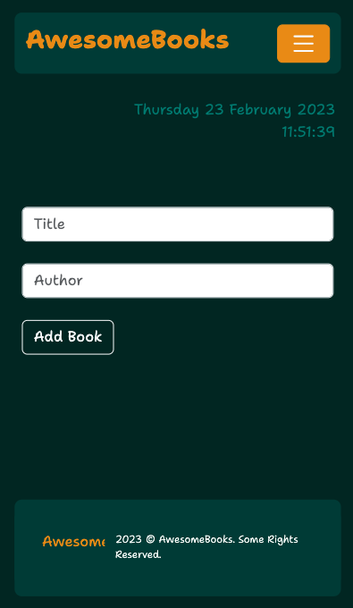
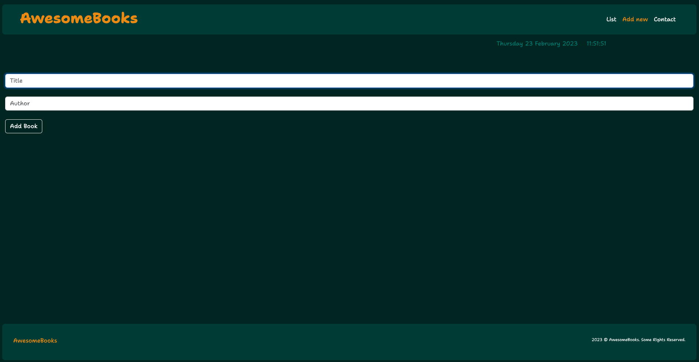

<a name="readme-top"></a>

<div align="center">
  <!-- You are encouraged to replace this logo with your own! Otherwise you can also remove it. -->
  
  <br/>

</div>

<!-- TABLE OF CONTENTS -->

# 📗 Table of Contents

- [📖 About the Project](#about-project)
  - [🛠 Built With](#built-with)
    - [Tech Stack](#tech-stack)
    - [Key Features](#key-features)
  - [🚀 Live Demo](#live-demo)
- [💻 Getting Started](#getting-started)
  - [Setup](#setup)
  - [Prerequisites](#prerequisites)
  - [Install](#install)
  - [Usage](#usage)
  - [Run tests](#run-tests)
  - [Deployment](#triangular_flag_on_post-deployment)
- [👥 Authors](#authors)
- [🔭 Future Features](#future-features)
- [🤝 Contributing](#contributing)
- [⭐️ Show your support](#support)
- [🙏 Acknowledgements](#acknowledgements)
- [❓ FAQ (OPTIONAL)](#faq)
- [📝 License](#license)

<!-- PROJECT DESCRIPTION -->

# 📖 [Awesome Books] <a name="about-project"></a>

> # Awesome Books

  
  

**[AwesomeBooks]** 

## 🛠 Built With <a name="built-with">html, scss, bootstrap, javascript</a>

### Tech Stack <a name="tech-stack">html, scss, bootstrap, javascript</a>

> html, scss, bootstrap, javascript

<!-- Features -->

### Key Features <a name="key-features"></a>

- **[Nav bar]**
- **[Addbook section]**
- **[list section]**
- **[contact section]**

<p align="right">(<a href="#readme-top">back to top</a>)</p>

<!-- LIVE DEMO -->

## 🚀 Live Demo <a name="live-demo"></a>

- [Live Demo Link](https://samtush.github.io/Awesome-books/)

<p align="right">(<a href="#readme-top">back to top</a>)</p>

<!-- GETTING STARTED -->

## 💻 Getting Started <a name="getting-started"></a>

> Clone the repo and contribate to the site.

To get a local copy up and running, follow these steps.

### Prerequisites

In order to run this project you need:

Internet connection to clone the project

### Setup

Clone this repository to your desired folder:


```sh
  cd my-folder
  git clone https://github.com/SamTush/Startup-battlefield.git
```

### Install

Install this project with: VS code or any other code editor.

### Usage

To run the project: Go live in VS or get a live server for your code editor.

### Run tests

To run tests, run linter:

### Deployment

You can deploy this project using: github

<p align="right">(<a href="#readme-top">back to top</a>)</p>

<!-- AUTHORS -->

## 👥 Authors <a name="authors"></a>

> All collaborators of this project.

👤 **Samson**

- GitHub: [@githubhandle](https://github.com/SamTush)
- Twitter: [@twitterhandle](https://twitter.com/samo44o)
- LinkedIn: [LinkedIn](https://www.linkedin.com/in/samson-tush-4a7386216/)

👤 **Abdul Ali Noori**

- GitHub: [@ab-noori](https://github.com/ab-noori)
- Twitter: [@AbdulAliNoori4](https://twitter.com/AbdulAliNoori4)
- LinkedIn: [abdul-ali-noori](https://www.linkedin.com/in/abdul-ali-noori-384b85195/)

<p align="right">(<a href="#readme-top">back to top</a>)</p>

<!-- FUTURE FEATURES -->

## 🔭 Future Features <a name="future-features"></a>

Add other pages in the future.

<p align="right">(<a href="#readme-top">back to top</a>)</p>

<!-- CONTRIBUTING -->

## 🤝 Contributing <a name="contributing"></a>

Contributions, issues, and feature requests are welcome!

Feel free to check the [issues page](../../issues/).

<p align="right">(<a href="#readme-top">back to top</a>)</p>

<!-- SUPPORT -->

## ⭐️ Show your support <a name="support"></a>

If you like this project, feel free to comment and contribute to it.

<p align="right">(<a href="#readme-top">back to top</a>)</p>

<!-- ACKNOWLEDGEMENTS -->

## 🙏 Acknowledgments <a name="acknowledgements"></a>

I would like to thanks to anyone viewing this project and giving a star.

<p align="right">(<a href="#readme-top">back to top</a>)</p>

<!-- FAQ (optional) -->

## ❓ FAQ (OPTIONAL) <a name="faq"></a>

<p align="right">(<a href="#readme-top">back to top</a>)</p>

<!-- LICENSE -->

## 📝 License <a name="license"></a>

This project is [MIT](./LICENSE) licensed.

<p align="right">(<a href="#readme-top">back to top</a>)</p>
